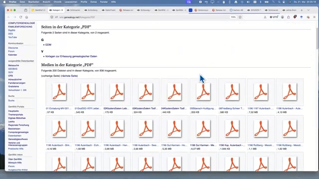
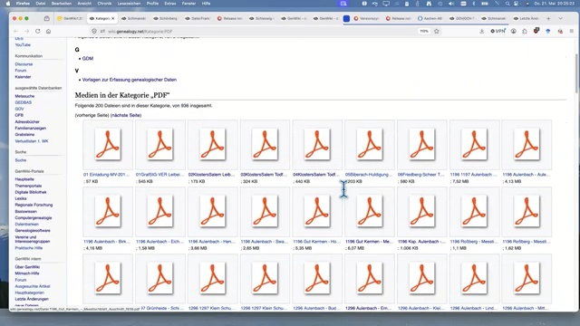
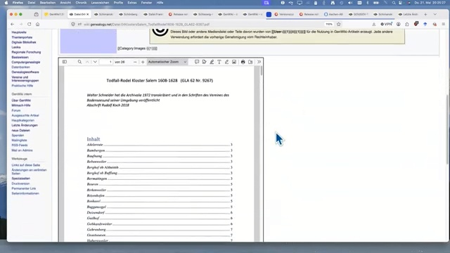
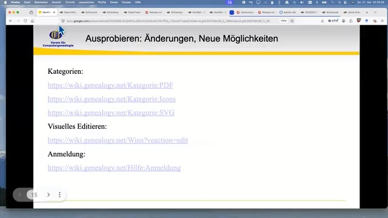
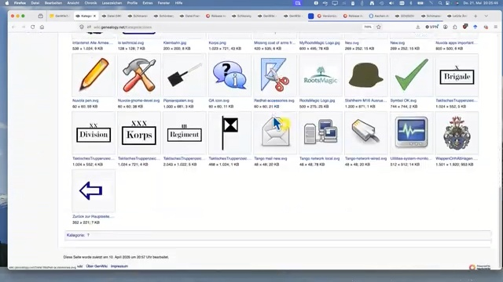
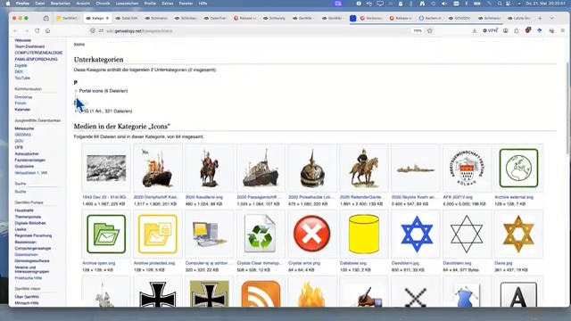
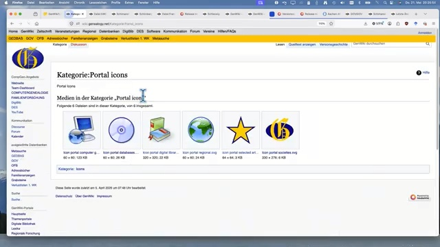
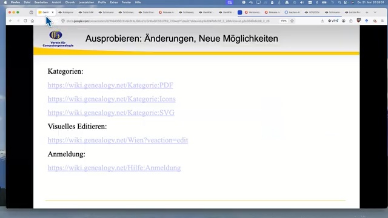
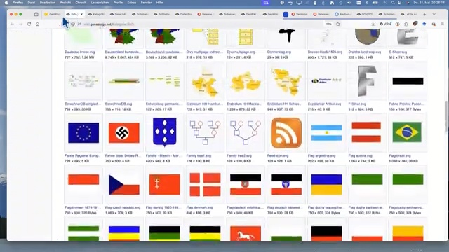

# reel-driven-development

Reel Driven Development (RDD) - turn recorded user walks (reels) into domain stories and outcome objects

| | |
| :--- | :--- |
| **PyPi** | [](https://pypi.python.org/pypi/reel-driven-development/) [](https://www.apache.org/licenses/LICENSE-2.0) [](https://pypi.org/project/reel-driven-development/) [](https://pypi.org/project/reel-driven-development/) [](https://pypi.org/project/reel-driven-development/) |
| **GitHub** | [](https://github.com/WolfgangFahl/reel-driven-development/actions/workflows/build.yml) [](https://github.com/WolfgangFahl/reel-driven-development/releases) [](https://github.com/WolfgangFahl/reel-driven-development/graphs/contributors) [](https://github.com/WolfgangFahl/reel-driven-development/commits/) [](https://github.com/WolfgangFahl/reel-driven-development/issues) [](https://github.com/WolfgangFahl/reel-driven-development/issues/?q=is%3Aissue+is%3Aclosed) |
| **Code** | [](https://github.com/psf/black) [](https://pycqa.github.io/isort/) |
| **Docs** | [](https://WolfgangFahl.github.io/reel-driven-development/) [](https://github.com/PyCQA/docformatter) [](https://google.github.io/styleguide/pyguide.html#s3.8-comments-and-docstrings) |

## Documentation
[Wiki](https://wiki.bitplan.com/index.php/Reel_Driven_Development)

### Authors
* [Wolfgang Fahl](http://www.bitplan.com/Wolfgang_Fahl)

## Reel Driven Development

A reel is a recorded user walk - e.g. a screen-share demo where a domain expert
walks through a system while talking. RDD treats the reel as a graph walk:

* every context switch (page, browser tab, application) and every relevant
  interaction (submenu, filter, zoom, sort) is a hop
* the narrative drives the sampling, never the clock
* every hop gets an evidence frame (screenshot) or a proven-absent note
* findings become outcome objects: a frustration spoken during a walk becomes
  a bug report, which is an acceptance criterion, which is an example

The first tooling milestone is HopDetection - see
[issue #1](https://github.com/WolfgangFahl/reel-driven-development/issues/1).

## Example: GenWiki walk

Acceptance run on the [test video](https://www.youtube.com/watch?v=gVxk-zRb0wQ)
segment 20:00-21:00 - a walk through wiki.genealogy.net category pages:

```bash
hopdetect ~/.rdd/cache/gVxk-zRb0wQ.mp4 --start 20:00 --end 21:00 --out hops
12 hops from 786 sampled frames -> hops/hops.json
```

Raw results in [examples/genwiki-walk](examples/genwiki-walk). Of the 12
detected hops, 9 are distinct content states of the walk (hop numbers kept as
in hops.json):

| hop | time | changes grouped | content | frame |
| --- | --- | --- | --- | --- |
| hop01 | 20:02 | 32 | Kategorie:PDF |  |
| hop02 | 20:06 | 11 | Kategorie:PDF, media section |  |
| hop03 | 20:10 | 24 | file page with PDF viewer (Todfall-Rodel Kloster Salem) |  |
| hop04 | 20:20 | 94 | presentation slide with category links |  |
| hop05 | 20:28 | 57 | Kategorie:Icons, media section |  |
| hop06 | 20:34 | 40 | Kategorie:Icons |  |
| hop07 | 20:37 | 2 | Kategorie:Portal icons |  |
| hop10 | 20:47 | 2 | presentation slide revisited |  |
| hop12 | 20:59 | 73 | Kategorie:SVG, flags gallery |  |

### False positives

Three detections are not content states of the walk - kept in the example as
tool findings:

| hop | time | reason |
| --- | --- | --- |
| hop08 | 20:41 | cursor-motion burst on the unchanged Kategorie:Portal icons page |
| hop09 | 20:45 | transient browser tab-hover preview overlay, page unchanged |
| hop11 | 20:50 | blank frame: Kategorie:SVG captured before rendering; the settled state is hop12 |
